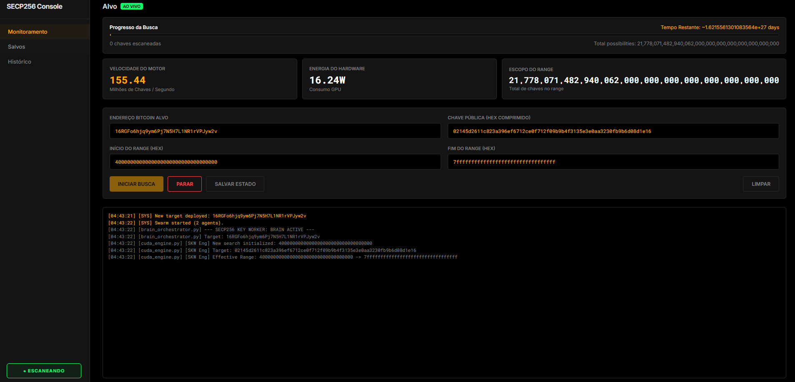
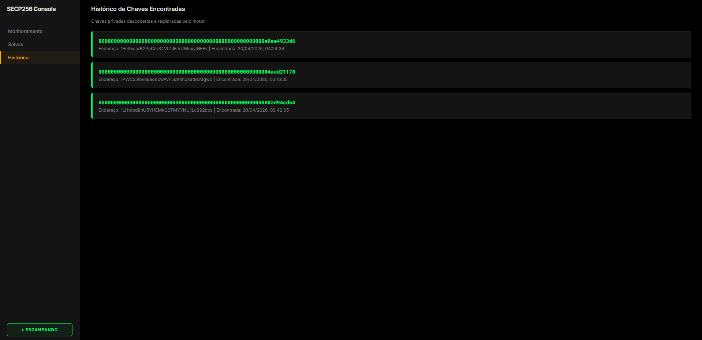

# SECP256 Key Worker Dashboard

Um scanner de alta performance para o puzzle do Bitcoin (SECP256k1), apresentando um motor GPU em tempo real e um dashboard web profissional para telemetria, rastreamento de progresso e detecção de chaves (hits).



## Funcionalidades
- **Motor GPU Acelerado**: Núcleo otimizado em CUDA/C++ para mapeamento rápido de pontos SECP256k1.
- **Telemetria em Tempo Real**: Monitore o throughput (MKeys/s), consumo de energia da GPU e progresso da busca.
- **Persistência Robusta**: Checkpointing e retomada automática — nunca perca o progresso da varredura.
- **Dashboard Web**: Interface moderna com tema escuro para implantação de alvos e monitoramento do console.



## Pré-requisitos
- **GPU NVIDIA**: Arquitetura Maxwell ou mais recente recomendada.
- **CUDA Toolkit**: Versão 11.0+ (Testado na v13.1).
- **Golang**: Versão 1.20+ para o Master Controller e API Server (substituindo o antigo Python).
- **Compilador MSVC**: Necessário para compilar o núcleo CUDA no Windows.

## Instalação

1. **Clone o repositório**:
   ```bash
   git clone https://github.com/seuusuario/secp256-key-worker.git
   cd secp256-key-worker
   ```

2. **Compile o Motor GPU**:
   Certifique-se de que o `nvcc` está no seu PATH. Execute o seguinte comando (ajuste de acordo com a versão do seu compilador, se necessário):
   ```bash
   nvcc -O3 kangaroo.cu -o kangaroo.exe
   ```

3. **Compile ambos os Servidores (Master e Miner)**:
   ```bash
   go mod tidy
   go build -o pool-master.exe ./cmd/pool-server
   go build -o pool-miner.exe ./cmd/pool-miner
   ```

4. **Baixe e Instale o Golang** (Caso não tenha):
   - [Baixar Go (Nativo Win)](https://go.dev/dl/)
   - Reinicie o terminal após instalar.

5. **Configure o alvo**:
   Copie a configuração de exemplo e atualize-a.
   ```bash
   copy current_target.json.example current_target.json
   ```

## Uso - Master (O Cérebro)

Inicie o Core Master da Pool:
```bash
.\pool-master.exe
```

Acesse o dashboard Master em: `http://localhost:8080`
*(Aqui você pode gerenciar qual é o alvo global que todos os seus mineradores trabalharão).*

## Uso - Trabalhadores (A GPU)

Nos computadores que vão rodar, rode o executável do Minerador, passando um IP do Master Server e o número de Wallet (para identificar o PC):
```bash
.\pool-miner.exe -pool="ws://localhost:8080/mine" -wallet="Minerador-01"
```
Ele se conectará ao seu servidor, pedirá um pedaço do sub-puzzle (`chunk` exclusivo dele) e ligará o poderoso algorítimo `kangaroo.exe` localmente com precisão cirúrgica sem interferir nos outros mineradores pelo mundo.

## Estrutura do Projeto
- `cmd/pool-server/main.go`: O Cérebro da rede. Contém a API do Dashboard, gere o banco de dados interno e transmite os "Chunks" dividos para as Placas Filhas.
- `cmd/pool-miner/main.go`: O Operário leve. Ele escuta ao WebSocket do Master, lança o Kangaroo e reporta velocidade em Mkeys/s de forma enxuta e reporta HIS precisos.
- `kangaroo.cu`: Código fonte CUDA puro para processamento pesado e paralelo em placas GPU.
- `dashboard.html`: Console web do Master.

## Licença
Este projeto está licenciado sob a Licença MIT - veja o arquivo LICENSE para detalhes.

## Aviso Legal
Este software é fornecido apenas para fins educacionais. O uso desta ferramenta para pesquisa criptográfica é de inteira responsabilidade do usuário.
